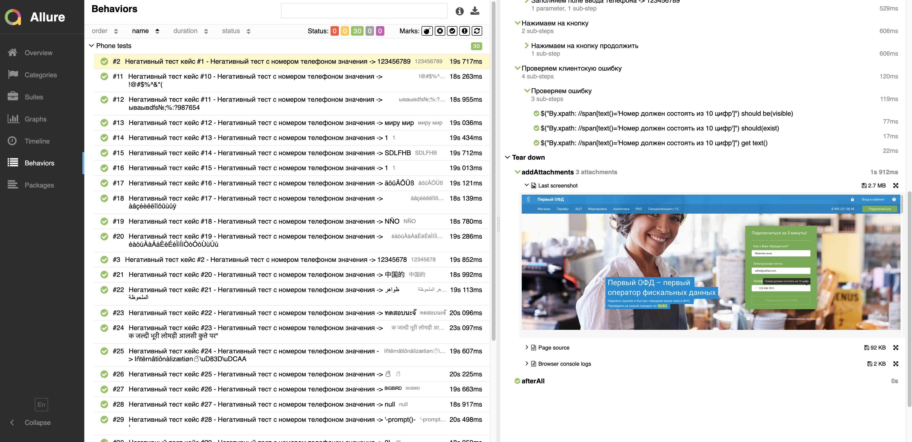
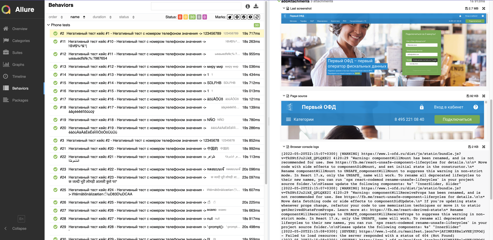

# testTaskOFD

# Java UI testing automation framework

### Simple UI test to https://www.1-ofd.ru/

##### This project build with stack: `Java + Selenide + Junit5 + Hamcrest + Allure `

## Запуск и прогон тестов

1. Склонировать репозиторий `git@github.com:ivan-strelka/testTaskOFD.git`
2. Выполнить команду в терминале `cd testTaskOFD`
3. Запустить прогон тестов из терминала `gradle clean web --stacktrace --info`
4. Запустить скачивание отчёта командой из терминала `gradle downloadAllure`
5. Запустить отчёт о прогоне тестов командой `gradle allureServe`

### Пример отчёта:

